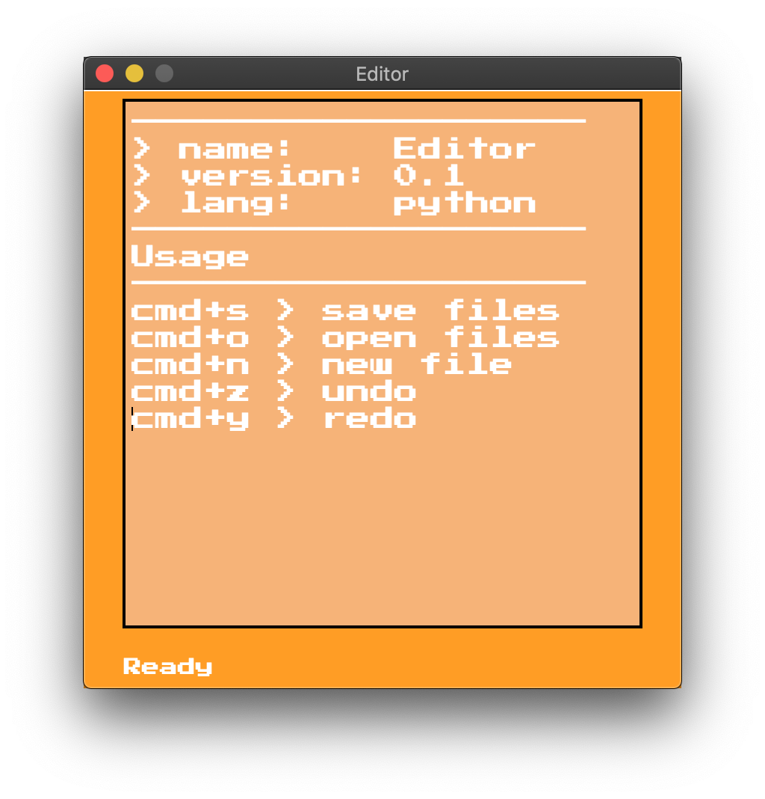
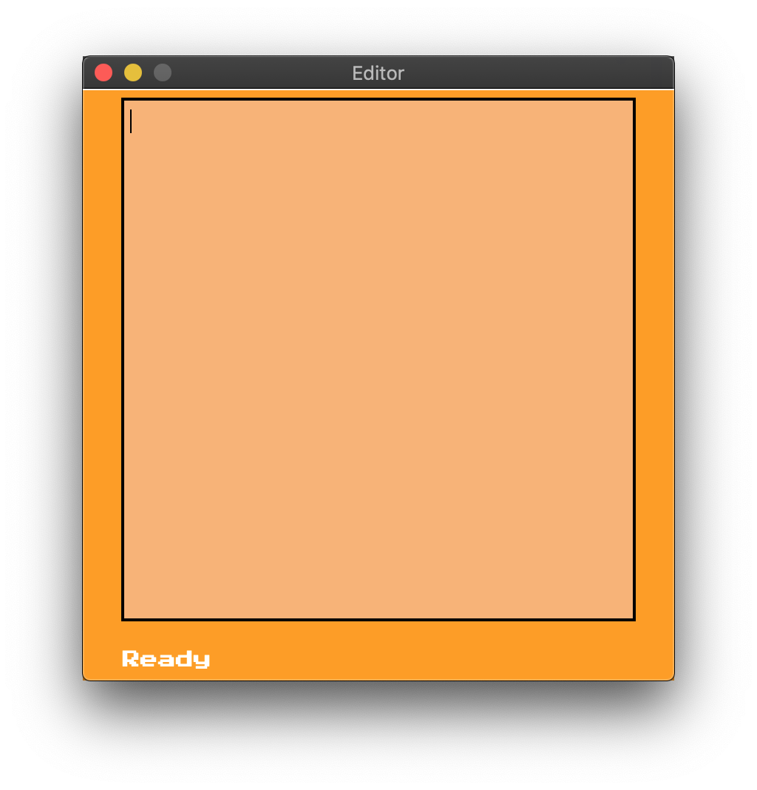
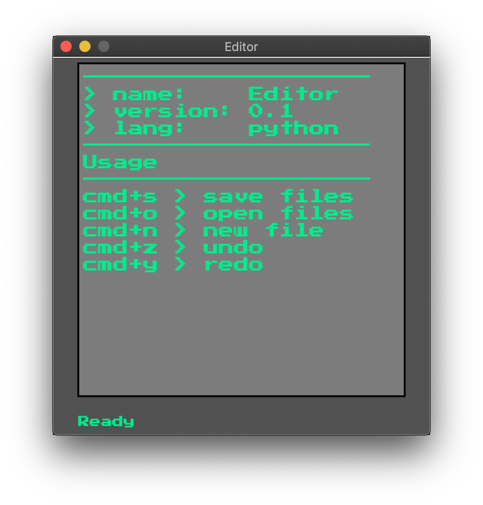

## Introduction
Super minimal text-editor for any kind of user!

This editor is at very early stage, and it still lacks
a lot of stuff. Also, some things for example 'language-menu' is
added into the editor, but it yet doesn't do anything.

## Requirements
* `python3-3.9`
* `tkinter`

## Installation
* git clone https://github.com/nikkelarsson/Editor.git

## Usage
* `python3 editor.py` or `python3.9 editor.py`
